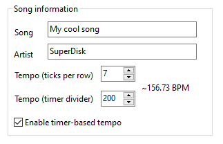

# Integration

Integrating hUGEDriver into your project depends on what you are using.

First, get the [release of hUGEDriver](https://github.com/SuperDisk/hUGEDriver/releases) that matches your version of hUGETracker.

### RGBDS (assembly)

Import [`hUGEDriver.asm`](https://github.com/SuperDisk/hUGEDriver/blob/master/hUGEDriver.asm) and [`hUGE.inc`](https://github.com/SuperDisk/hUGEDriver/blob/master/include/hUGE.inc) (in the `include` directory) into your project (songs need the latter as well).
You will additionally need [`hardware.inc`](https://github.com/gbdev/hardware.inc) 4.2 or later, if you don't already.

Then, simply compile `hUGEDriver.asm` with the rest of your code, and you're done!

### GBDK (C)

hUGEDriver releases contain a pre-compiled `.lib` for use with GBDK-2020. Link it while compiling, include `hUGEDriver.h`, and you're done:

```sh
lcc ... -Wl-lhUGEDriver.lib
```

If you want to compile the driver yourself, a few extra steps are necessary.

0. You will need [RGBDS](https://rgbds.gbdev.io), and [Python](https://www.python.org/)
1. Assemble hUGEDriver: `rgbasm -o hUGEDriver.obj hUGEDriver.asm`
3. Convert the object file: `python tools\rgb2sdas.py -o hUGEDriver.o hUGEDriver.obj`
4. Import `hUGEDriver.h` into your project
5. Simply link `hUGEDriver.o` with the rest of your code, and you're done!

## Usage

There are two parts to using hUGEDriver: *initializing* a song, and *playing* a song.

### Initialization

You begin playing a song by passing a pointer to it to the `hUGE_init` function.
How can you get such a pointer, though?
Simple!
The "song descriptor" that you choose when exporting your song names a label (assembly) / variable (C) that points to the song!
So if your song descriptor was, say, `ryukenden`:

<table><thead><tr><th>Assembly</th><th>C</th></tr></thead><tbody><tr><td>

```avrasm
ld hl, ryukenden
call hUGE_init
```

</td><td>

```c
hUGE_init(ryukenden);
```

</td></tr></tbody></table>

### Playing

The function `hUGE_dosound` plays a single tick of the current song when called.

First and foremost, *how often* should that function be called? That actually depends on what the song expects!



If the song does not use "timer playback", then `hUGE_dosound` must be called once per frame.
This is usually done either by calling it from your game's main loop, or by calling it from your VBlank interrupt handler.
However, if the song *does* use timer playback, then you must set the timer registers appropriately (TODO), and call `hUGE_dosound` from the timer interrupt handler.

Using an interrupt handler exposes you to two additional constraints:

- `hUGE_dosound` must not run in the middle of `hUGE_init`.
- `hUGE_dosound` must not be called before the first call ever to `hUGE_init`.

Preferably, create a variable that you set to 0 on boot before calling `hUGE_init`, and to 1 after `hUGE_init` returns; in the interrupt handler, skip calling `hUGE_dosound` if the variable isn't 0. An alternative is to disable interrupts (ASM: `di`+`ei`, GBDK: `__critical`) while you call `hUGE_init`.
