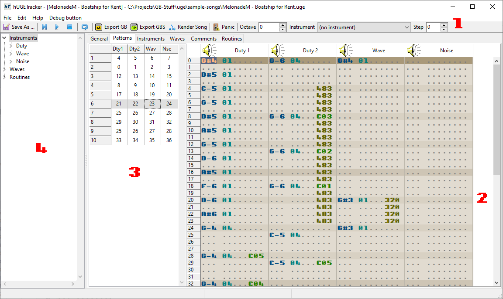

# Interface

The hUGETracker interface is styled similarly to conventional trackers such as [ModPlug Tracker](https://www.modplug.com) / [OpenMPT](https://openmpt.org) or [ProTracker](https://en.wikipedia.org/wiki/ProTracker).
If you're comfortable composing in a tracker interface, then you'll feel right at home.

Legend:
1. [Tracker grid](./tracker-grid.md)
2. [Order editor](./order-editor.md)
3. [Song components](./song-components.md)
4. [Toolbar](./toolbar.md)
