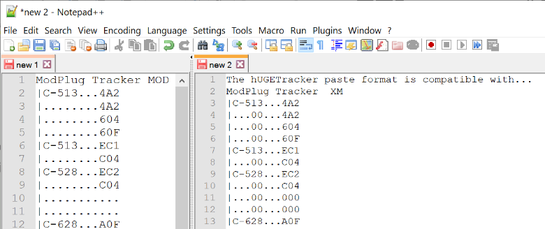
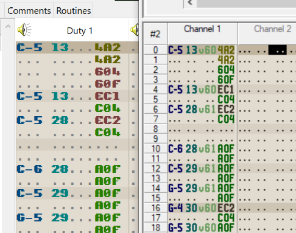

# Miscellaneous

Here are some random things about hUGETracker.

## The clipboard

The clipboard format for hUGETracker is compatible with [ModPlug Tracker](https://www.modplug.com) / [OpenMPT](https://openmpt.org)!
This means that you can convert your existing `.mod`, `.xm`, `.s3m`, or `.it` chiptunes into Game Boy tunes very quickly by just copying and pasting your patterns into hUGETracker.
Note that the effects are not converted when pasted, so you'll need to manually adjust the effects to work in hT.

## File format

The hUGETracker file format is very simple; the reading/writing code [can be found here](https://github.com/SuperDisk/hUGETracker/blob/hUGETracker/src/song.pas).

The file format might change to an NBT-, JSON-, or XML-based format in the future.
