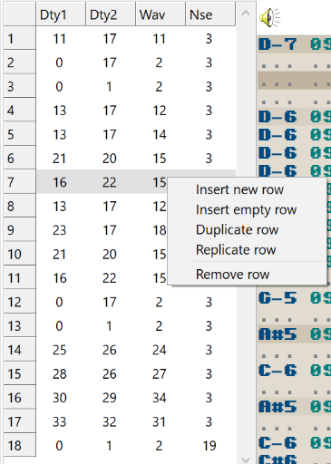

<figure style="float: right;">

</figure>

# Order editor

The **order editor** is where you arrange the structure of your song.
Since most music tends to be fairly repetitive, you can define any number of patterns and arrange them here.

Each number identifies one complete pattern containing the four Game Boy channels shown in the tracker grid.

Much like the tracker grid, the order editor's highlighted row moves downward each time a new **order** is reached.
The song loops back to the first order when the last order is finished playing.

An **order** is a row in this table.

<kbd>Right-click</kbd> to open the popup menu, where you can:

- **Insert new row** — Inserts a row referring to a new blank pattern.
- **Insert empty row** — Inserts a row referring to pattern 0.
- **Duplicate row** — Inserts another reference to the highlighted pattern.
- **Replicate row** — Inserts a new pattern containing a copy of all four channels in the highlighted pattern.
