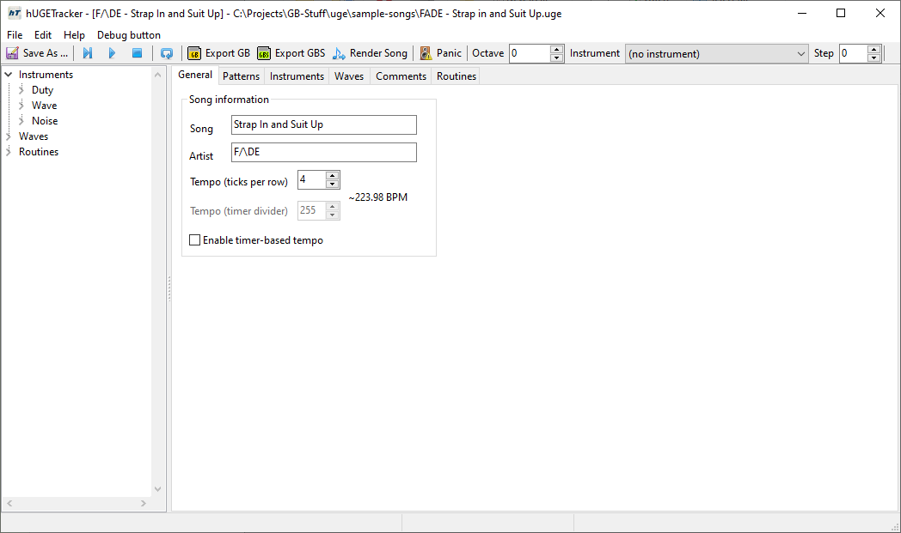

# General

The **general** tab allows specifying the name, artist, and tempo of your song.
Name and artist are limited to 255 characters each.
Tempo is limited to a value between 0 and 20.

> The **tempo** actually has an inverse relationship to the speed of the song: a higher value results in a slower song.
