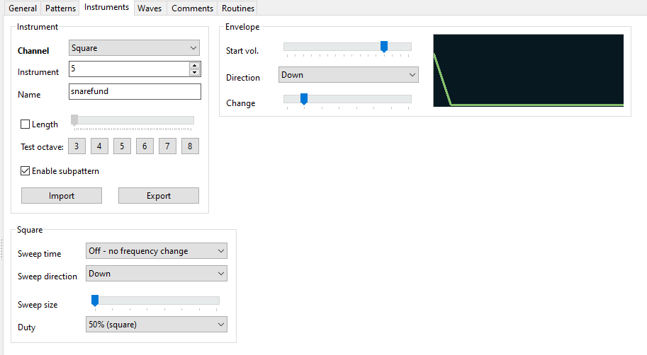
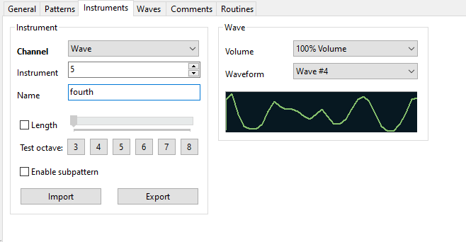
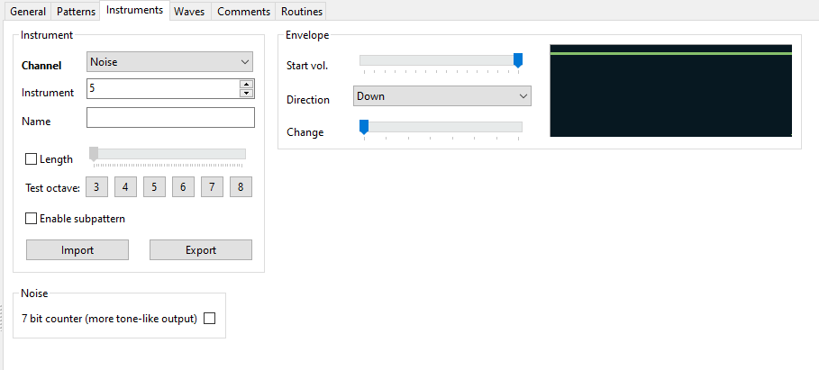

# Instruments

Legend:

1.  **Instrument number**: This selects which instrument of its type to edit. Ranges from 1 to 15 (inclusive).
2.  **Instrument name**: This is the name for the instrument. It is shows in the instrument combobox in the [toolbar](../toolbar.md) and in the [song components](../song-components.md).
3.  **Instrument type**: Selects which "type" of instrument this is. Can be **square**, for instruments to be played on the pulse channels; **wave**, for instruments to be played on the wave channel; and **noise**, for instruments to be played on the noise channel.
4.  **Length**: When enabled, a playing note will be cut off immediately after a certain amount of time elapses.
5.  **Test C-5**: Plays a test note for a few seconds, to test what the instrument will sound like.
6.  **Import/Export buttons**: Used to import or export an instrument's settings to/from a file.
7.  **Sweep time**: Selects the "sweep time" for the note to take. The greater the value, the slower the sweep.
8.  **Sweep direction**: Selects the direction of the sweep the note should take. "Up" portamentos the note up, "Down" portamentos it down.
9.  **Sweep size**: Selects the magnitude of sweep for the note to take per "tick" as specified by sweep time.
10. **Duty**: Selects the timbre of note to play. Each setting sounds different, and they are useful when you don't want both of the duty channels to clash with one another.
11. **Start vol**: Selects the starting volume for the envelope. When there's no change on the envelope, this functions simple as the volume for the note, unless overridden by a [volume effect command](../effect-reference.md).
12. **Direction**: This specifies which direction for the envelope to go.
13. **Change**: This specifies for how long the envelope goes. The higher the value, the more the note will fade in or out.
14. **Wave volume**: Specifies at what volume a wave instrument shall play, unless overridden by a [volume effect command](../effect-reference.md).
15. **Waveform**: Specifies which waveform should play as part of this instrument. See [waves](./waves.md).
16. **Shift clock mask**: A component of the noise generation algorithm. Tweak it however you want.
17. **Dividing ratio**: A component of the noise generation algorithm. Tweak it however you want.
18. **7-bit counter**: When checked, the instrument will sound more like a musical tone rather than noise.
19. **Randomize**: Rather than manually tweaking the sliders, you can click this button until you hear something you like. Plays a random configuration of sliders, with a random length, at a random pitch.
