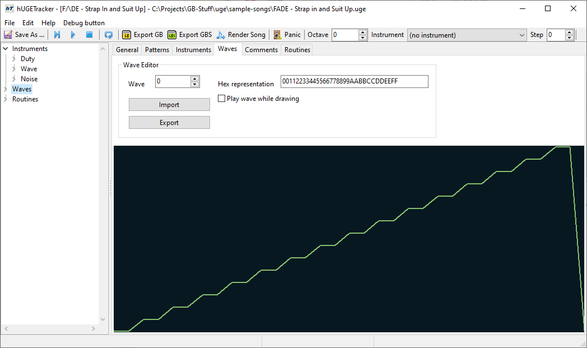

# Waves

The **waves** tab allows you to edit **waveforms** for use by instruments.
Use the spinner to select which wave you want to edit, and draw manually with the mouse in the displayed waveform viewer.
Waves can also be imported from and exported to files.
