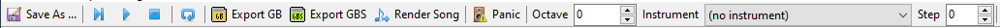

# Toolbar

The toolbar contains various functions that are useful when writing music:

- **Save as...** — Saves your song to a file.
- **Start** — Plays your song from the very beginning.
- **Cursor** — Plays your song starting from the current cursor position. Useful when editing a specific pattern.
- **Stop** — Halts playback.
- **Export .GB** — Assembles your song into a standalone `.gb` file, for playback in an emulator or a real Game Boy!
- **Export .GBS** — Assembles your song into a standalone `.gbs` file, for playback in a program such as [gbsplay](https://mmitch.github.io/gbsplay).
- **Render song** — Exports your song in either `.wav` or `.mp3` format.
- **Panic** — Silences all channels immediately. Useful when something has happened, and a tone is playing that you want to make stop.
- **Octave** — Selects the octave offset for the [tracker grid].
- **Instrument** — Selects the instrument with which to input new notes in the [tracker grid]. Any new note entered will be accompanied by this instrument number, and a preview note will play with this instrument.
- **Step** — Selects the **step** for the [tracker grid]. After inputting a new note, the cursor will move down by this many rows; useful for inputting drum tracks or arpeggios.

[tracker grid]: ./tracker-grid.md
