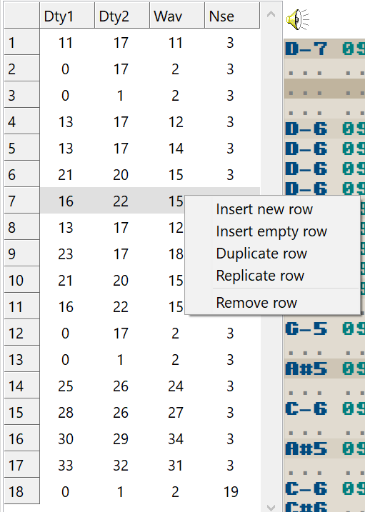

<figure style="float: right;">

</figure>

# Order editor

The **order editor** is where you arrange the structure of your song.
Since most music tends to be fairly repetitive (a single drum pattern is often enough for the majority of the song, for instance), you can define any number of patterns and arrange them here.

Each column corresponds to a channel in the tracker grid.

Much like the tracker grid, the order editor's highlighted row moves downward each time a new **order** is reached.
The song loops back to the first order when the last order is finished playing.

An **order** is a row in this table.

<kbd>Right-click</kbd> to open the popup menu, where you can:

- **Insert new row** — Inserts a row with all brand-new pattern numbers.
- **Insert empty row** — Inserts a row with all zeros in it.
- **Duplicate row** — Inserts a row which has the same pattern numbers as the one currently highlighted.
- **Replicate row** — Inserts a row with all brand-new pattern numbers, and these new patterns are copies of the highlighted row's.
