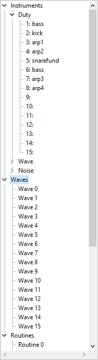

# Song components

<figure style="float: left;">

</figure>

The components of a hUGETracker song are shown here.
Listed are instruments along with their names, waves numbered from 0 to 15, and routines numbered from 0 to 15.

Double-<kbd>left click</kbd>ing on any of these will bring you to the tab for editing it.
