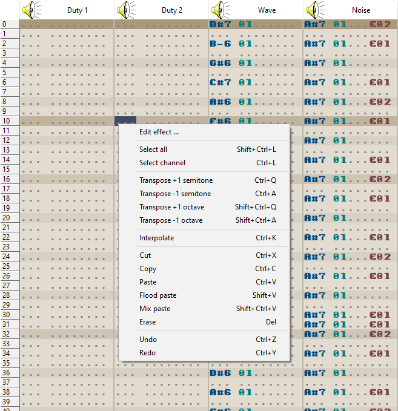

# Tracker grid

The **tracker grid** displays four patterns together.
This represents one row in the **order table**, and is the component used to compose a song.
When a different order is selected in the **order table**, the patterns in the **tracker grid** are updated to reflect their contents.

<figure>
<svg width="191" height="623">
	<image href="img/pattern.png"/>
	<rect x="0" y="32" width="50" height="589" class="note"/>
	<rect x="58" y="32" width="34" height="589" class="instr"/>
	<rect x="130" y="32" width="50" height="589" class="fx"/>
</svg>
</figure>

In a given pattern, there are 64 rows of cells.
Each cell is divided into three parts: the **note**, the **instrument**, and the **effect**.

A note ranges from `C-3` to `B-8`, and is the pitch of the tone that will play on that cell.

An instrument is a value from 01 to 15, which specifies which instrument parameters will be applied to the playing note.

An effect is the combination of an **effect code** (the first hexadecimal digit, from `0` to `F`) and its **effect parameter** (the last two hexadecimal digits, from `00` to `FF`).
See the [effect reference](./effect-reference.md) for more details.
You can use the Effect Editor to create the effect values for you, if you're not comfortable entering hexadecimal directly.

The keyboard is used to enter values into the three parts of a cell: the keys <kbd>Q</kbd> through <kbd>\\</kbd>, <kbd>A</kbd> through <kbd>\`</kbd>, and <kbd>Z</kbd> through <kbd>/</kbd> each represent an octave with which to enter notes.
The **octave offset** can be modified in the toolbar to allow for higher or lower note values.

The numeric keys can enter values into the instrument column.

The numeric keys, as well as keys <kbd>A</kbd> through <kbd>F</kbd>, enter values into the effect column.

<svg width="780" height="110" style="clear: left;">
	<defs>
		<g id="arrow">
			<polyline points="0,70 0,0"/>
			<polyline points="-13,13 0,0 13,13" fill="none"/>
		</g>
	</defs>
	<image href="img/highlighted_row.png"/>
	<use href="#arrow" x="300" y="65"/>
</svg>

While a song is playing, the highlighted row, representing the row currently being played, moves downwards on the patterns.
The tempo of your song (speed at which the highlighted row moves) can be adjusted in the General tab.

<svg width="780" height="251">
	<image href="img/channel_headers.png"/>
	<use href="#arrow" x="15" y="50"/>
	<use href="#arrow" x="407" y="50"/>
</svg>

The **headers** of the channels are clickable, and will mute/unmute the playback of a specific channel when playing a song.

<figure>

</figure>

The tracker grid also features a right-click menu for opening the [effect editor](./effect-editor.md), and performing various editing tasks.
These can all be accomplished by [using the hotkeys](./hotkeys.md) as well.
